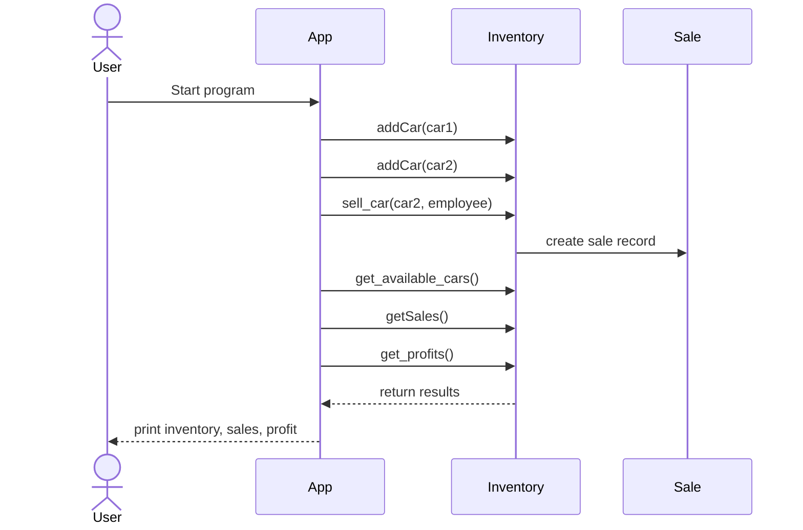
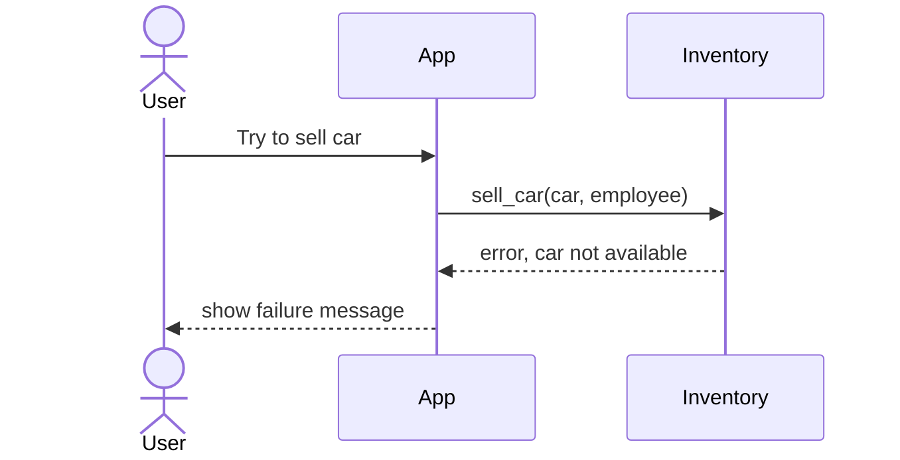

# Sequence Diagram

## Happy Flow

```mermaid
sequenceDiagram
    actor User
    participant App
    participant Inventory
    participant Sale

    User->>App: Start program
    App->>Inventory: addCar(car1)
    App->>Inventory: addCar(car2)
    App->>Inventory: sell_car(car2, employee)
    Inventory->>Sale: create sale record
    App->>Inventory: get_available_cars()
    App->>Inventory: getSales()
    App->>Inventory: get_profits()
    Inventory-->>App: return results
    App-->>User: print inventory, sales, profit
```

## Alternative Flow

```mermaid
sequenceDiagram
    actor User
    participant App
    participant Inventory

    User->>App: Try to sell car
    App->>Inventory: sell_car(car, employee)
    Inventory-->>App: error, car not available
    App-->>User: show failure message
```
