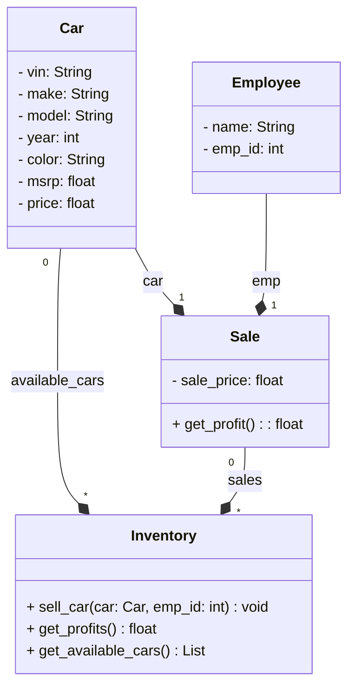

# UML Diagram

```mermaid
classDiagram
    class Car {
        - vin: String
        - make: String
        - model: String
        - year: int
        - color: String
        - msrp: float
        - price: float
    }

    class Inventory {
        + sell_car(car: Car, emp_id: int) void
        + get_profits() float
        + get_available_cars() List<Car>
    }

    class Sale {
        - sale_price: float
        + get_profit(): float
    }

    class Employee {
        - name: String
        - emp_id: int
    }

    Car "0" --* "*" Inventory: available_cars
    Sale "0" --* "*" Inventory: sales
    Car --* "1" Sale: car
    Employee --* "1" Sale: emp
```
